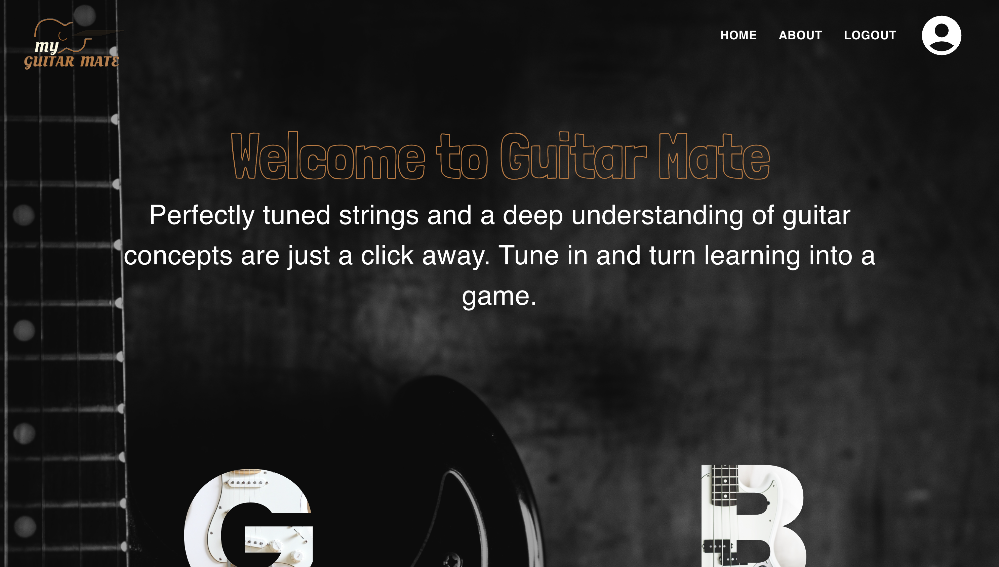
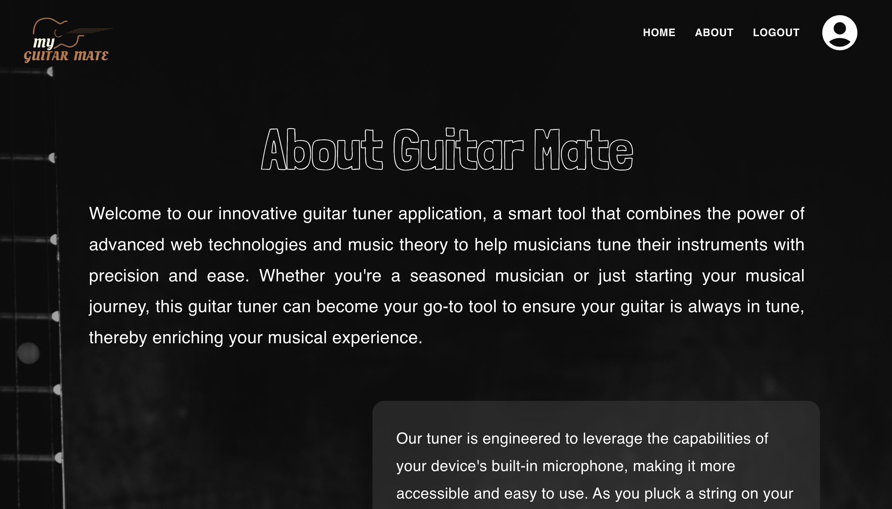
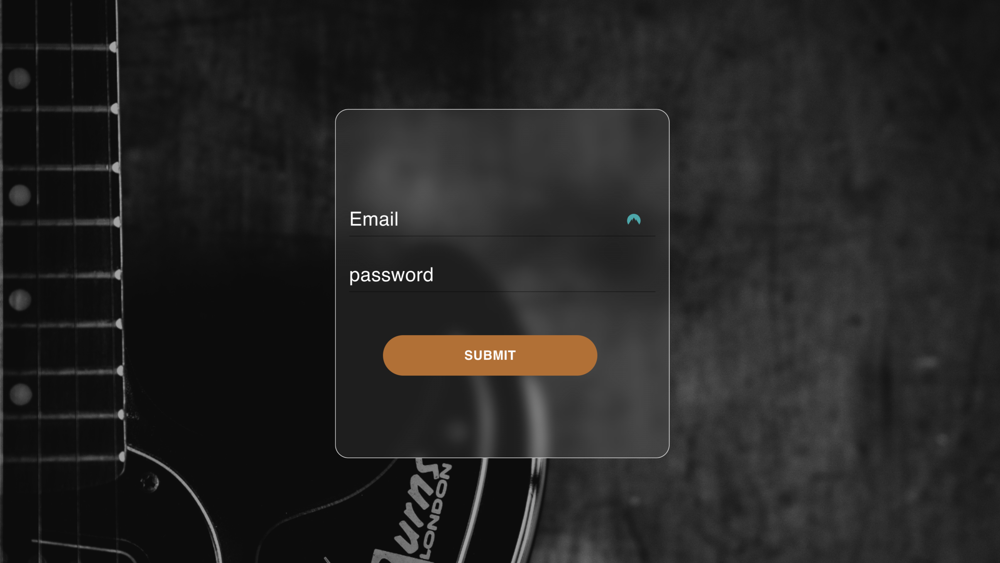

# My-Guitar-Mate

  
## Description:

Welcome to our innovative guitar tuner application, a smart tool that combines the power of advanced web technologies and music theory to help musicians tune their instruments with precision and ease. Whether you're a seasoned musician or just starting your musical journey, this guitar tuner can become your go-to tool to ensure your guitar is always in tune, thereby enriching your musical experience.

Our tuner is engineered to leverage the capabilities of your device's built-in microphone, making it more accessible and easy to use. As you pluck a string on your guitar, our tuner listens carefully through your device's microphone, capturing the sound and translating it into data using the Web Audio API - a high-level JavaScript API for processing and synthesizing audio in web applications.

Once the audio data is obtained, it undergoes a complex but efficient process of pitch detection using the DynamicWavelet algorithm. This sophisticated algorithm performs an analysis of the frequency domain to recognize the pitch of the note you're playing. The DynamicWavelet algorithm has been selected for its superior accuracy and performance, enabling real-time analysis of audio signals with precision.

After detecting the pitch, our tuner then maps it to the corresponding musical note based on standard musical frequencies. Through a user-friendly interface, the detected note is displayed, providing you with immediate, actionable feedback.

## Table of Contents:
- [My-Guitar-Mate](#my-guitar-mate)
  - [Description:](#description)
  - [Table of Contents:](#table-of-contents)
- [Overview](#overview)
  - [The Task](#the-task)
  - [The Challenge:](#the-challenge)
  - [User Story](#user-story)
  - [Acceptance Criteria](#acceptance-criteria)
  - [Usage Instructions](#usage-instructions)
  - [Repository Link:](#repository-link)
  - [Deployed Applicaiton](#deployed-applicaiton)
  - [Screenshots.](#screenshots)
    - [Figure 1 Application text editor](#figure-1-application-text-editor)
  - [Installation Process](#installation-process)
  - [Built With](#built-with)
  - [What I Learned](#what-i-learned)
  - [Author](#author)

# Overview

## The Task

## The Challenge:
Projects have played a key role in your journey to becoming a full-stack web developer. As you apply for development jobs, your portfolio is absolutely vital to opening doors to opportunities. Your portfolio showcases high-quality deployed examples of your work, and you can use your finished projects for that very purpose.

This project is a fantastic opportunity to show employers your collaborative skills and coding abilities, especially in the context of a scalable, user-focused MERN app. Remember that employers want to know what you can do, but they also want to know how you work with other developers. The more examples of deployed collaborative work you have in your portfolio, the more likely you are to get an interview and a job.

## User Story
```md
As a guitar learner,
I WANT the application to listen to the guitar notes I play,
SO THAT I can know if I am playing the right notes and make adjustments as needed.
User Story:

GIVEN that I am on the guitar tuning page,
WHEN I play a guitar string,
THEN the application should listen to the note I played,
AND display the corresponding guitar note to me.

As a guitar beginner,
I WANT to play interactive games that teach me guitar concepts,
SO THAT I can learn and understand these concepts in a fun and engaging way.
User Story:

GIVEN that I am on the game page,
WHEN I choose to start a new game,
THEN the application should provide me with a fun interactive game,
AND the game should involve tasks that require understanding of guitar concepts,
AND provide feedback as I progress through the game,
SO THAT I can learn and reinforce my understanding of these guitar concepts.


```

## Acceptance Criteria
```md
Given a guitar tuning application,
When I load the application,
Then I am presented with a button to start the tuning process and a display area for the detected note and its tuning status.
When I click on the 'Start Tuning' button,
Then the application prompts me to allow access to my microphone and starts listening to the audio input.
When I play a note on my guitar,
Then the application processes the audio input, identifies the pitch of the note, and displays the note along with its tuning status in real-time.
Given a guitar learning application,
When I load the application,
Then I am presented with a menu with the options 'Start Game', 'Learn Guitar Concepts', and a selection area to choose the concept I want to learn.
When I click on the 'Start Game' button,
Then the application presents me with an interactive game based on the selected guitar concept.
When I make actions in the game,
Then the game responds in real-time and provides feedback based on my performance.
When I finish the game or choose to exit,
Then the application saves my progress or score and allows me to restart or choose a new concept to learn.
```


## Usage Instructions

1. Navigate to [Click Here](https://guitar-app.azurewebsites.net/)
2. Allow the application to use your micophone.
3. Then get turning and learning.


## Repository Link:
[Repository Link 'Click Here'.](https://github.com/MaxKeable/GutiarApp)

## Deployed Applicaiton 
[Click Here to view deployed app.](https://guitar-app.azurewebsites.net/)

## Screenshots.
### Figure 1 Application text editor







## Installation Process
1. Clone git repo.
2. install dependencies.
3. run npm run develop in parent directory.

## Built With

- RESTFUL API 
- TypeScript
- Node.js: [Version 16.18.1](https://nodejs.org/en/blog/release/v16.18.1/)
- Express.js:[Express.js](https://expressjs.com/en/starter/installing.html)
- Nodemon: [2.0.12](https://www.npmjs.com/package/nodemon/v/2.0.12)
- Visual Studio Code: [Website](https://code.visualstudio.com/)
- Microsoft Azure

## What I Learned
1. How to create a full stack MERN app
2. How to deploy a full stack MERN app to Azure
3. How to use the Web audio API
4. Further understand algorithms

## Author

Follow us on Github at [MaxKeable](https://github.com/MaxKeable)! & [Toby Carroll](https://github.com/tjsoho) Additional questions or concerns? feel free to contact us at max.keable@blocksoftware.com.au & toby.carroll@blocksoftware.com.au


© 2023 [MaxKeable](https://github.com/MaxKeable) & [Toby Carroll](https://github.com/tjsoho). Confidential and Proprietary. All Rights Reserved.